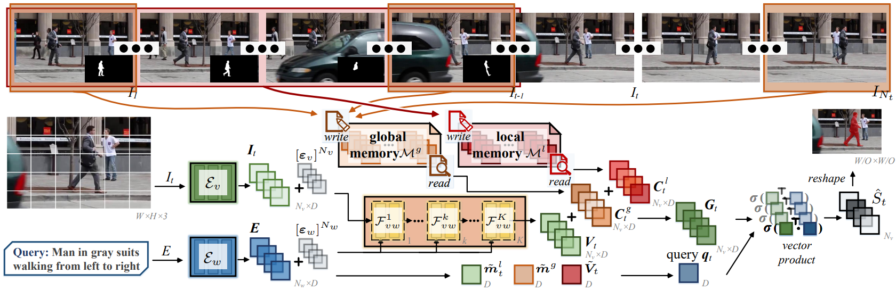

# Locater: Local-Global Context Aware Transformer for Language-Guided Video Segmentation

<div align="center">
  
</div>

> This repository is an official PyTorch implementation of paper:<br>
> [Local-Global Context Aware Transformer for Language-Guided Video Segmentation](https://arxiv.org/abs/2203.09773).<br>
> [Chen Liang](https://leonnnop.github.io/), [Wenguan Wang](https://sites.google.com/view/wenguanwang/), [Tianfei Zhou](https://www.tfzhou.com/), [Jiaxu Miao](https://scholar.google.com/citations?user=kQ-FWd8AAAAJ&hl=en), [Yawei Luo](https://scholar.google.com.sg/citations?user=pnVwaGsAAAAJ&hl=en), [Yi Yang](https://scholar.google.com/citations?user=RMSuNFwAAAAJ&hl=zh-CN) <br>
> arXiv 2022.

## News & Update Logs:
- [x] [2022-03-17] Repo created. Paper, code, and data will come in a few days. Stay tuned.
- [x] [2022-03-18] Inference code, pretrained weights, and data for A2D-S+ released.
- [x] [2022-03-21] [arXiv](https://arxiv.org/abs/2203.09773) (full paper available)
- [ ] Instructions on usage
- [ ] Training code and detailed instructions
- [ ] Code for dataset creation

## Abstract

We explore the task of language-guided video segmentation (LVS). Previous algorithms mostly adopt 3D CNNs to learn video representation, struggling to capture long-term context and easily suffering from visual-linguistic misalignment. In light of this, we present Locater (local-global context aware Transformer), which augments the Transformer architecture with a finite memory so as to query the entire video with the language expression in an efficient manner. The memory is designed to involve two components -- one for persistently preserving global video content, and one for dynamically gathering local temporal context and segmentation history. Based on the memorized local-global context and the particular content of each frame, Locater holistically and flexibly comprehends the expression as an adaptive query vector for each frame. The vector is used to query the corresponding frame for mask generation. The memory also allows Locater to process videos with linear time complexity and constant size memory, while Transformer-style self-attention computation scales quadratically with sequence length. To thoroughly examine the visual grounding capability of LVS models, we contribute a new LVS dataset, A2D-S+, which is built upon A2D-S dataset but poses increased challenges in disambiguating among similar objects. Experiments on three LVS datasets and our A2D-S+ show that Locater outperforms previous state-of-the-arts. Further, our Locater based solution achieved the 1st place in the Referring Video Object Segmentation Track of the 3rd Large-scale Video Object Segmentation Challenge.

## A2D-S+ Dataset

<!-- ## Installation -->

### Data Preparation

Please first download raw videos/masks of [A2D](https://web.eecs.umich.edu/~jjcorso/r/a2d/)/[JHMDB](http://jhmdb.is.tue.mpg.de/) and then download reformatted sentence annotations from [here](https://pan.baidu.com/s/1xdgYwhFIslr7-XEy9N5keQ) (code: rvos). **Annotations for A2D-S+** is also available at [here](https://pan.baidu.com/s/1xdgYwhFIslr7-XEy9N5keQ) (code: rvos).
They are recommended to be organized as following:

```
code_root/
└── datasets/
    └── A2D_SUBSET/
        ├── A2D_NORM/
        ├── A2D_MUL/
        ├── A2D_SPAT/
        └── A2D_TEMP/
        	├── mask/
        	├── vid_frames_dict.pth
        	└── A2D_TEMP_test_expressions.json
    └── JHMDB/
        ├── images/
        ├── mask/
        ├── vid_frames_dict.pth
        └── JHMDB_test_expressions.json
    
```

**NOTE**: This repository is not compatible with original [A2D Sentences](http://jhmdb.is.tue.mpg.de/) and [JHMDB Sentences](http://jhmdb.is.tue.mpg.de/) annotations.

## Evaluation

Download [trained weights](https://pan.baidu.com/s/1xdgYwhFIslr7-XEy9N5keQ) (code: rvos).

Example: evaluate ```Locater``` on ```A2D-S``` and ```A2D-S+```:

```
# Evaluate on A2D-S NORM
torchrun --nproc_per_node=#NUMBER_GPUS tools/evaluate.py --dataset A2D --testing-type NORM --snapshot /path/to/checkpoint_file

# Evaluate on A2D-S MUL
torchrun --nproc_per_node=#NUMBER_GPUS tools/evaluate.py --dataset A2D --testing-type NUL --snapshot /path/to/checkpoint_file

# Evaluate on A2D-S SPAT
torchrun --nproc_per_node=#NUMBER_GPUS tools/evaluate.py --dataset A2D --testing-type SPAT --snapshot /path/to/checkpoint_file

# Evaluate on A2D-S TEMP
torchrun --nproc_per_node=#NUMBER_GPUS tools/evaluate.py --dataset A2D --testing-type TEMP --snapshot /path/to/checkpoint_file

```

## License

The implementation codes of Locater are released under the MIT license. 
Find details in the [LICENSE](LICENSE) file for more information.


## Citation

If you find Locater useful or inspiring, please consider citing:

```bibtex
@article{liang2022locater,
  title      = {Local-Global Context Aware Transformer for Language-Guided Video},
  author     = {Liang, Chen and Wang, Wenguan and Zhou, Tianfei and Miao, Jiaxu and Luo, Yawei and Yang, Yi},
  journal  = {arXiv preprint arXiv:2203.09773},
  year       = {2022}
}
```

## Acknowledgment

Our implementation is partly based on the following codebases. We gratefully thank the authors for their wonderful works: 
[vognet](https://github.com/TheShadow29/vognet-pytorch),
[timm](https://github.com/rwightman/pytorch-image-models).


## Contact

This repository is currently maintained by [Chen Liang](mailto:leonnnop@gmail.com).
